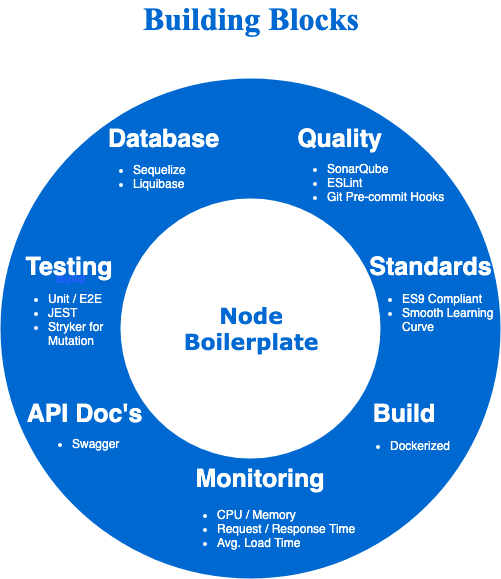
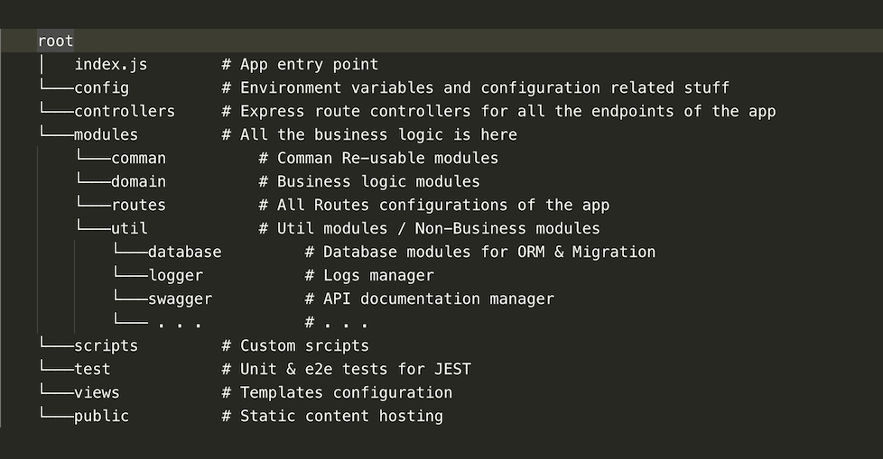
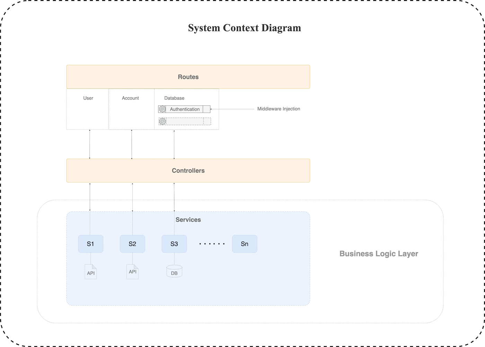

# raw-node-boilerplate

## Features
- Winston Logger/Elasticsearch
- Dockerized
- ES9
- Error Escallations (Application Level)
- JEST suit (unit & e2e)
- Stryker
- Express Status Monitor
- Swagger (Swagger UI)
- Sequelize
- Liquibase
- ESLint (Autofix CLI + Git Pre-Commit Hook)
- SonarQube (Native Scanner + Report Dashboard)

## Running the project
- Quick Start : `npm start`
- Health Status Monitor : `/status`
- Swagger API Docs : `/api-docs`

## Build & Run the project in Docker
- `npm run docker:build`
- `npm run docker:run`

## Unit Tests
- `npm run test`

##  Mutation Tests
- `stryker run`
- `npx stryker run --fileLogLevel trace --logLevel debug` (Debug Stryker Execution)

## Liquibase Migration
- `npm run migration`
- `LQ_OP_COUNT=1 npm run undo-migration` (Rollback with Count : LQ_OP_COUNT : 1 as Default )

## Running Linter
- `npm run eslint-autofix <filepath/folder-pattern>` (Lint for specific files)

## SonarQube
- `npm run sonarqube` (Local SonarQube Server)
- `npm run sonar` (Sonar Project Scan)
- SonarQube Report : `http://localhost:9000`

## Folder Structure

## System Context
